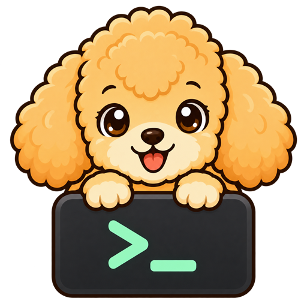
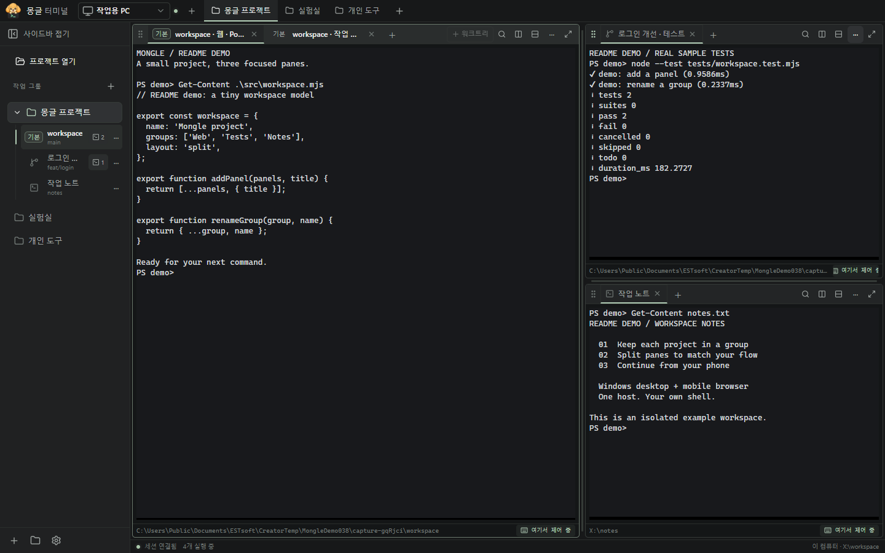
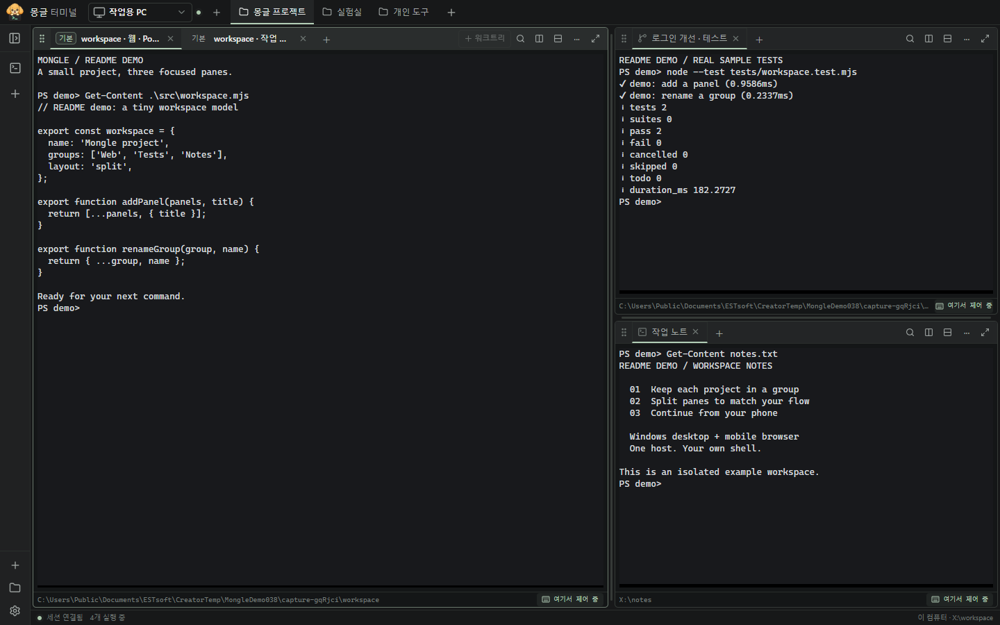
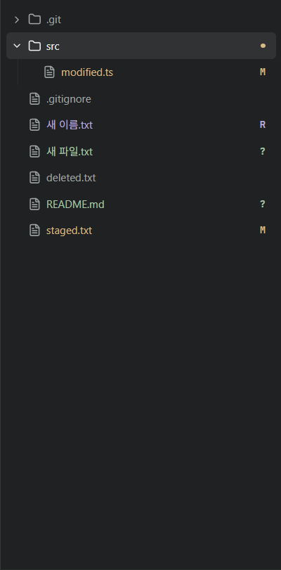
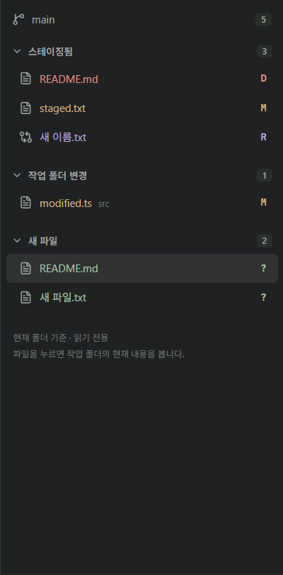
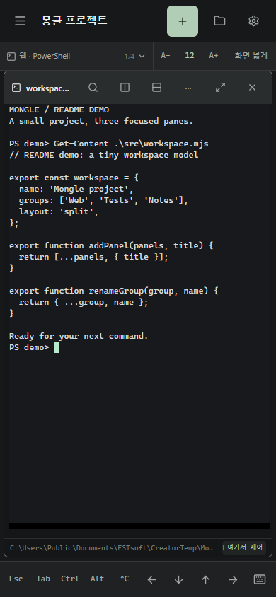

<div align="center">



# 몽글터미널

### 작업은 그대로. 어디서든, 이어서.

여러 폴더의 터미널을 한곳에.<br />워크트리로 나누고, 휴대폰에서 이어서.

[](docs/IMPLEMENTATION-STATUS.md)

**[Windows 다운로드](https://github.com/bokjk/mongle-terminal-releases/releases/latest)**

[사용 안내](docs/USER-GUIDE.md) · [변경 이력](CHANGELOG.md) · [기여하기](CONTRIBUTING.md)

</div>

<br />



<p align="center"><sub>격리된 예제 프로젝트와 실제 Windows 셸로 촬영한 0.3.8 화면입니다.</sub></p>

## 한 화면에서, 각자의 작업을

<table><tr>
<td width="33%"><strong>모아서 정리</strong><br /><br />서로 다른 폴더의 터미널을 작업 그룹 하나에. 이름을 붙이고 목록에서 바로 찾습니다.</td>
<td width="33%"><strong>나눠서 집중</strong><br /><br />탭을 옮기고 화면을 분할하세요. 워크트리로 같은 저장소의 다른 작업도 함께 진행합니다.</td>
<td width="33%"><strong>어디서든 계속</strong><br /><br />작업 PC에서 실행 중인 터미널에 다른 PC나 휴대폰으로 다시 연결합니다.</td>
</tr></table>

PowerShell·명령 프롬프트와 설치된 Git Bash·WSL을 사용합니다. Claude·Codex 같은 CLI도 평소처럼 실행하세요. 밝은 테마와 어두운 테마, 글자 크기 조절, 검색, 선택 후 자동 복사와 우클릭 붙여넣기를 지원합니다.

긴 출력은 마우스를 누른 채 터미널 위·아래 경계 밖으로 드래그해 이전·다음 줄까지 선택할 수 있습니다. 0.3.12에서는 출력 갱신 중 자동 스크롤이 멈추던 문제를 수정했습니다. [검증 범위](docs/validation/terminal-drag-scroll.md)를 참고하세요.

**0.3.14 공개:** 화면 갱신이 CLI의 드래그 이동·버튼 해제를 끊는 문제와 `Shift+드래그` 자동 복사 누락을 수정하고, 작은 휠 입력의 누적 상태를 보존하도록 보완했습니다. Claude 자체 안내가 가린 글자는 복사에서 빠질 수 있으며, 해당 프로그램의 제약은 남아 있습니다. [실제 앱 검사와 남은 범위](docs/validation/claude-native-selection.md).

모바일에서는 마우스 스크롤을 지원하는 Claude·Codex 전체화면에서도 한 손가락으로 대화를 위아래로 움직일 수 있도록 보완했습니다. 이 스크롤은 CLI 입력이므로 필요하면 제어권을 가져오며, 키보드를 자동으로 열지는 않습니다. 일반 터미널 기록은 보기 전용 상태에서도 로컬 스크롤합니다. Chrome의 Android 화면·터치 에뮬레이션 자동 검사와 실제 Claude·Codex 연결의 양방향 스크롤을 확인했습니다. 0.3.14에 공개했으며, 실물 휴대폰 검증은 별도입니다.

같은 수정본의 실제 Windows 앱에서 Codex CLI 0.160.0도 검사했습니다. 생성 중 선택·느린 드래그·Shift 선택과 한글 포함 300줄의 화면 경계 스크롤 복사가 원문과 일치했습니다. [Codex 검사 범위](docs/validation/codex-native-selection.md).

**0.3.11에서는 오른쪽 파일 편집 영역과 마크다운 미리보기를 제공합니다.** 파일을 탭으로 열어 편집·저장하고, 마크다운을 편집 / 미리보기 / 나란히 보기로 전환합니다. 큰 문서 처리와 파일 읽기 대기열을 개선하고, 미저장 종료·업데이트와 외부 변경 덮어쓰기를 막습니다.

**0.3.12에는 PDF 보기를 추가했습니다.** `.pdf`를 누르면 같은 오른쪽 파일 탭에서 페이지 이동·확대/축소·너비 맞춤과 텍스트 선택을 사용할 수 있습니다. PDF는 읽기 전용이며 파일당 8 MiB, PDF 탭 4개까지 지원합니다. [사용법](docs/USER-GUIDE.md#pdf-보기--0312) · [검증 범위](docs/validation/pdf-preview.md)

**0.3.15 공개:** 모바일 설치형 웹앱(PWA)과 브라우저의 **설정 → 앱 업데이트 → 화면 새로고침**에서 PC 업데이트 후 새 화면을 불러옵니다. 미저장·저장 중인 파일은 먼저 정리해야 하며, 새로고침은 PC의 터미널 작업을 종료하지 않습니다. [사용법과 제약](docs/validation/mobile-refresh.md)

모바일 터치 스크롤은 천천히 밀 때 손가락 이동을 따라가고, 빠르게 넘기면 짧게 감속하도록 바꿨습니다(0.3.15). 다시 터치하면 멈추며 글자를 작게 해도 CLI에 보내는 스크롤 신호가 늘어나지 않습니다. **설정 → 화면 → 모바일 스크롤 속도**에서 0.25~2배(기본 0.5배)로 조절합니다. 이 기기에만 저장하며 마우스 휠에는 적용하지 않습니다. 터미널은 행 단위로 표시되며 CLI별 실제 이동량과 네트워크 지연에 따라 느낌이 달라질 수 있습니다. [검증 범위](docs/validation/mobile-scroll-speed.md)

## 화면은 간결하게, 작업 영역은 넓게

**0.3.15:** CLI가 완료·입력 대기 알림을 보내면 작업 목록과 탭 오른쪽에 작은 점을 표시합니다. 접힌 그룹과 모바일 전환 목록에서도 찾을 수 있고, 해당 터미널 화면을 확인하면 사라집니다. CLI의 터미널 알림 설정이 필요할 수 있습니다. [알림 사용법](docs/USER-GUIDE.md#작업-알림-점--0315)

컴퓨터 선택과 작업 그룹 전환을 얇은 상단 줄에 모았습니다. **왼쪽 사이드바 맨 위**에서 접고 펼칠 수 있습니다. 접으면 44px 아이콘 줄만 남고, 같은 자리에 펼치기 버튼이 유지됩니다.



- **필요할 때만 목록을 펼치세요.** 접힌 상태에서도 터미널 전환·새 터미널·파일 탐색기·설정을 사용할 수 있습니다.
- **돌아와도 익숙한 화면입니다.** 접힘 상태와 펼친 너비를 기억하며, 접고 펼쳐도 실행 중인 셸과 분할 배치는 유지됩니다.
- **글자 크기는 편한 대로.** PC 기본값은 13px, 모바일은 11px입니다(0.3.15부터 모바일 11px, 기존 0.3.14는 14px). 이전에 저장한 크기는 유지하며 **설정 → 화면**에서 바꿀 수 있습니다.

[화면 조작 자세히 보기](docs/USER-GUIDE.md#간결한-pc-화면)

## 시작은 터미널 하나부터

현재 공개 버전은 **0.3.15 Windows 미리보기**입니다. [최종 검사와 공개 파일 검증](docs/validation/public-release-0.3.15.md)을 마쳤습니다.

1. **[Windows 11 x64 설치 파일](https://github.com/bokjk/mongle-terminal-releases/releases/latest)**을 받아 설치합니다. 현재 공개 버전은 **0.3.15 미리보기**입니다.
2. **새 터미널**을 누르고 셸과 시작 폴더를 고릅니다. Git 저장소가 아니어도 사용할 수 있습니다.
3. 탭 옆 **+**로 터미널을 더하고, 탭 제목을 가장자리로 끌어 화면을 나눕니다.
4. 다른 기기에서 이어 쓰려면 **설정 → 원격 연결**에서 연결을 준비합니다.

<details>
<summary>설치 파일과 ZIP, 업데이트 안내</summary>

아래 파일명은 **0.3.15** 기준입니다.

- **설치 파일:** `MongleTerminal-Setup-0.3.15-x64.exe`. 현재 사용자용으로 설치하며 관리자 권한이 필요하지 않습니다. 설치본은 새 버전을 확인·다운로드한 뒤 사용자 확인을 받아 설치합니다.
- **ZIP:** `MongleTerminal-0.3.15-x64.zip`. 폴더 전체를 풀고 `MongleTerminal.exe`를 실행합니다. 업데이트는 수동으로 교체합니다.
- Node.js는 배포본에 포함됩니다. 사용할 셸과 Git은 PC에 설치되어 있어야 합니다.
- 현재 코드 서명이 없는 미리보기입니다. Windows의 보호 안내가 나타나면 다운로드 출처를 확인하세요.
- **0.3.0 이하**는 새 공개 업데이트 주소로 전환하려면 0.3.1 이상 설치 파일을 한 번 직접 설치해야 합니다. 수동 교체 전에는 작업을 저장하고 앱 메뉴의 **완전 종료…**를 사용합니다.

[설치·업데이트 자세히 보기](docs/USER-GUIDE.md) · [배포와 검증 범위](docs/RELEASING.md)

</details>

## 워크트리, 필요한 터미널에서 바로

**작업 그룹은 터미널을 모으는 공간입니다.** 한 그룹 안에 프런트엔드 저장소, 백엔드 저장소, 일반 폴더를 함께 둘 수 있습니다. 워크트리는 만들기를 누른 **터미널의 현재 Git 저장소**를 기준으로 합니다.

1. 터미널 상단의 **+ 워크트리**를 누릅니다. 좁은 영역에서는 **···** 메뉴에 있습니다.
2. 작업 이름과 기준 브랜치를 입력하고 **생성 후 터미널 열기**를 선택합니다. 폴더와 브랜치 이름은 고급 설정에서 바꿀 수 있습니다.
3. 나중에 왼쪽 목록의 이름을 누르면 연결된 터미널로 이동합니다. 열려 있는 터미널이 없으면 그때 하나를 만듭니다.

| 목록에서 보이는 것 | 의미 |
|---|---|
| **기본** 배지 + 프로젝트 이름 | 저장소의 기본 작업 폴더 |
| 가지 아이콘 + 작업 이름 | 추가 워크트리 |
| 터미널 아이콘 + 터미널 이름 | Git 작업에 연결하지 않은 일반 터미널 |
| 터미널 개수 | 같은 워크트리에 연결된 터미널 선택 |

같은 폴더의 Windows 짧은 경로·폴더 별칭도 실제 위치를 기준으로 연결합니다. 목록은 이름과 보조 정보 두 줄로 정리했습니다. **··· → 이름 변경**으로 알아보기 쉽게 바꾸고, 긴 경로와 브랜치는 마우스를 올려 확인합니다. **프로젝트 열기**로 Git 폴더를 먼저 등록할 수도 있습니다.

터미널을 닫아도 워크트리 폴더는 남습니다. 삭제는 앱에서 만든 워크트리에만 제공하며, 연결된 터미널이나 남은 변경·새 파일·ignored 파일이 있으면 중단합니다. 삭제해도 브랜치와 커밋은 유지합니다.

[생성·선택·삭제 자세히 보기 →](docs/USER-GUIDE.md#프로젝트와-워크트리)

## 탭을 옮겨도, 실행 중인 작업은 그대로

각 분할 영역에 독립된 탭과 **+**가 있습니다. 탭을 분리했다가 다른 탭 옆으로 다시 가져오거나 순서만 바꿀 수 있습니다.

| 하고 싶은 일 | 조작 |
|---|---|
| 새 탭 열기 | **+** — 바로 왼쪽 마지막 탭의 현재 폴더를 기본값으로 사용 |
| 선택한 터미널 옆에 새 탭 | `Ctrl+Shift+T` — 현재 선택한 터미널의 폴더 기준 |
| 탭 분리 | 탭이 둘 이상인 영역에서 탭 제목을 가장자리로 끌기 |
| 탭 합치기·순서 변경 | 탭 제목줄의 삽입선 위치에 놓기; **+** 위는 맨 뒤 |
| 영역 전체 이동 | 왼쪽 점 손잡이로 끌기 |

현재 폴더를 보고하지 않는 셸은 시작 폴더를 사용합니다. `Ctrl+Tab` / `Ctrl+Shift+Tab`으로 현재 영역의 탭을 전환합니다. Windows Codex CLI의 **Shift+Enter** 줄바꿈과 한글 조합 직후 연속 입력도 개선했습니다. 실제 키 동작은 실행 중인 프로그램의 설정을 따릅니다.

[탭과 분할 사용법 →](docs/USER-GUIDE.md#그룹과-분할)

## 파일과 Git 변경을 바로 옆에

**파일 탐색기**는 마지막으로 선택한 터미널의 현재 폴더를 따라갑니다. **파일 / Git**을 전환하면 폴더 트리와 변경 목록을 확인할 수 있습니다. 원격 터미널에서는 해당 PC의 파일을 보여 줍니다.

<table><tr>
<td align="center"><br /><sub>파일 트리와 변경 상태</sub></td>
<td align="center"><br /><sub>상태별 Git 변경 목록</sub></td>
</tr></table>

위 Git 화면은 0.3.6에서 촬영했습니다. 0.3.11의 파일 편집 동작은 아래 안내를 따릅니다.

**0.3.11 파일 편집:** 파일을 누르면 오른쪽 독립 편집 영역의 탭으로 엽니다. 텍스트 편집·`Ctrl+S` 저장·찾기/바꾸기와 마크다운의 **편집 / 미리보기 / 나란히 보기**를 제공합니다. 목록을 접거나 편집기를 최대화할 수 있으며 터미널·폴더를 바꿔도 열린 파일과 수정 내용은 유지합니다. 외부 변경은 저장 충돌로 알립니다. 파일과 UTF-8 저장 내용 각각 64 KiB 이하가 편집 대상이며, HTML 실행이나 외부 이미지 자동 로드는 하지 않습니다. 커밋·스테이징은 계속 터미널에서 진행합니다.

마크다운 처리는 화면 입력과 분리하며 빠른 입력 중에는 최신 내용으로 미리보기를 갱신합니다. 큰 문서는 입력 후 미리보기가 잠시 늦게 따라올 수 있습니다. 탭 전환뿐 아니라 편집기를 숨겼다 다시 열어도 실행 취소·다시 실행 기록과 커서 위치를 유지합니다. 이 기록은 현재 앱의 메모리에만 보관합니다. [성능 측정 조건과 검증 범위](docs/validation/file-editor.md#입력-응답과-숨김-복원-후속-안정화)를 함께 확인하세요.

폴더를 접거나 탐색 위치를 바꾸면 아직 시작하지 않은 폴더 조회를 취소합니다. 따로 연 파일 탭은 계속 읽어 오며, 늦게 도착한 내용이 현재 선택한 파일을 바꾸지 않습니다. Git에서 삭제를 스테이징한 뒤 같은 경로에 다시 만든 파일도 현재 내용으로 엽니다.

[파일 탐색기와 Git 보기 →](docs/USER-GUIDE.md#파일-탐색기)

## 휴대폰에서도 같은 터미널

<table><tr>
<td width="38%" align="center"></td>
<td>
<h3>QR로 연결하고, 브라우저에서 이어 쓰세요.</h3>
<p>작업 PC와 휴대폰에서 Tailscale을 켠 다음 원격 연결 설정의 QR코드를 스캔합니다. 첫 연결은 코드 입력과 작업 PC의 승인을 거칩니다.</p>
<p>터미널 전환, Esc·Tab·Ctrl·방향키, 글자 크기 조절과 이전 출력 스크롤을 지원합니다. 입력할 터미널을 누르면 그 기기로 제어권이 넘어옵니다.</p>
<p>작업 PC와 실행부가 켜져 있어야 합니다. 한 번에 한 기기가 입력을 제어하며, 일반 터미널 기록 스크롤이나 창 활성화만으로 다른 기기의 입력을 가져오지 않습니다. 0.3.14의 CLI 터치 스크롤은 프로그램에 입력을 보내므로 필요하면 제어권을 가져옵니다.</p>
<p><a href="docs/USER-GUIDE.md">원격 연결 안내 →</a></p>
</td>
</tr></table>

<p align="center"><sub>이미지는 모바일 크기의 브라우저 데모입니다. 실물 휴대폰 캡처는 아닙니다.</sub></p>

## 창 닫기와 작업 종료

| 동작 | 실행 중인 셸 | 다시 열면 |
|---|---|---|
| 창의 **X** | 계속 실행 | 트레이·바로가기로 복귀 |
| **앱 종료 · 터미널 유지** | 계속 실행 | 같은 호스트와 셸에 재연결 |
| **완전 종료…** 또는 PC 재시작 | 종료 | 저장한 그룹·배치·폴더·허용된 출력 기록과 **새 셸** 복원 |

완전 종료나 재부팅 뒤에는 이전 명령, CLI 대화, 개발 서버를 자동으로 다시 실행하지 않습니다. 사용자 데이터는 기본적으로 `%LOCALAPPDATA%\MongleTerminal`에 보관하며 업데이트·제거 시 자동 삭제하지 않습니다.

## 개발과 기여

소스 저장소는 공개되어 있습니다. 설치 파일과 자동 업데이트는 기존 [배포 전용 저장소](https://github.com/bokjk/mongle-terminal-releases/releases/latest)를 유지합니다. 문제 보고·기여 절차와 현재 라이선스 상태는 [기여 안내](CONTRIBUTING.md), 취약점의 비공개 접수는 [보안 제보 안내](SECURITY.md)를 확인하세요.

0.3.10의 측정 조건은 [응답성·안정성 검증 기록](docs/validation/responsiveness-reliability.md)에, 공식 태그·패키지 검사와 공개 파일 전체 다운로드·해시 결과는 [배포 기록](docs/validation/public-release-0.3.10.md)에 정리했습니다. 실제 사용자 설치본 교체는 별도입니다.

**Windows 11 x64 · Node.js 24.x · Chrome**이 필요합니다. 소스 저장소 접근 권한이 있는 환경에서 실행합니다.

```powershell
npm.cmd ci
node node_modules/node-pty/scripts/prebuild.js
node node_modules/node-pty/scripts/post-install.js
node node_modules/esbuild/install.js
node node_modules/electron/install.js

# 실사용 터미널과 분리한 개발 프로필
$env:MONGLE_DATA_DIR = Join-Path $env:TEMP 'mongle-dev-profile'
npm.cmd run dev
```

네이티브 준비 명령은 설치 스크립트가 차단된 환경에서도 잠금 파일에 고정된 런타임을 준비합니다. UI 검사에 필요한 Chrome은 `npx.cmd playwright install chrome`으로 설치할 수 있습니다.

아이콘은 빌드 전용 `sharp`로 원본 PNG에서 생성합니다. 예전 `IconBuilder.exe`를 컴파일하거나 실행하지 않으며 백신 검사 제외가 필요하지 않습니다. 기존 파일의 탐지 재현과 확인 범위는 [알약 검사 기록](docs/validation/antivirus-icon-builder.md)에 정리했습니다.

변경은 **`dev`에서 만든 주제 브랜치 → `dev` PR**로 제출합니다. 배포는 **`dev` → `main` PR**을 거칩니다. 격리 실행, 필수 검사와 문서 기준은 [기여 안내](CONTRIBUTING.md)를 확인하세요.

자동 검사 구성은 PR 설명·알려진 문서 변경을 짧은 Linux 검사로 분리하고, 코드 변경·배포 PR에는 Windows 전체 검증을 유지합니다. 병합 직전 최신 base를 반영한 검사 결과를 확인하며, 병합 후 중복 빌드는 실행하지 않습니다. 최종 태그의 설치 파일 검증은 별도로 수행합니다. 구성의 실제 적용·검증 상태는 [Actions 사용량 기록](docs/validation/actions-usage.md)을 참고하세요.

공개 협업을 고려해 코드 PR의 전체 회귀 검사는 유지합니다. 웹 UI만 추가·수정한 기여 PR은 별도 설치 리허설을 생략하지만, 데스크톱·호스트·패키징·의존성·설치본에 담기는 문서·Windows 아이콘 원본 변경 및 배포 PR은 실제 설치·교체·복원 검사도 수행합니다.

<details>
<summary>개발 명령과 코드 구조</summary>

| 명령 | 용도 |
|---|---|
| `npm.cmd run typecheck` | TypeScript 검사 |
| `npm.cmd run build` | 웹·호스트·Electron 빌드 |
| `npx.cmd tsx --test --test-concurrency=1 tests/**/*.test.ts` | 빌드 후 순차 회귀 검사 |
| `node --import tsx scripts/release-check.ts` | 버전·README·CHANGELOG 정합성 |
| `node --import tsx scripts/package.ts --output release-candidate` | 별도 폴더에 패키징 |

`apps/desktop`·`apps/web`은 화면, `packages/host`는 실행부, `packages/terminal`은 터미널 표시·입력을 담당합니다. `platform`·`scripts`·`tests`에는 Windows 연결과 개발·검증 도구가 있습니다.

실사용 앱이 있는 `release/`를 덮어쓰지 마세요. MSIX 개발 도구의 AppData 가상화와 OwnerPipe 검증 경로는 [프로필 분리 기록](docs/validation/msix-profile-recovery.md)에 설명합니다. CI 통과와 서버 측 병합 제한의 적용 상태는 [기여 안내](CONTRIBUTING.md#자동-검사와-병합-제한의-현재-상태)에서 구분합니다.

</details>

## 문서

| 사용하기 | 함께 만들기 |
|---|---|
| [사용자 안내](docs/USER-GUIDE.md) | [기여 절차](CONTRIBUTING.md) |
| [변경 이력](CHANGELOG.md) | [설계 문서](docs/README.md) |
| [구현·검증 범위와 알려진 제약](docs/IMPLEMENTATION-STATUS.md) | [보안 문제 제보](SECURITY.md) |
| [배포·자동 업데이트](docs/RELEASING.md) | [이미지 출처와 README 참고 사례](docs/assets/README.md) |

Windows 실제 앱과 선택 실행 검증, 모바일 에뮬레이션, 실물 기기 검증은 구분해 기록합니다. 실사용 NSIS 설치본 교체·OS 재부팅·모든 WSL 및 모바일 브라우저 조합은 추가 확인 대상입니다.

---

<div align="center">

프로젝트는 현재 **private / UNLICENSED**입니다.<br />공개 라이선스는 별도로 결정하며, 이 안내가 새 사용 허가를 부여하지 않습니다.<br />[제3자 고지](docs/THIRD-PARTY-NOTICES.md) · [캐릭터 출처](docs/branding/README.md)

</div>

<!-- release-0.3.14-finalized -->

<!-- release-0.3.15-finalized -->
