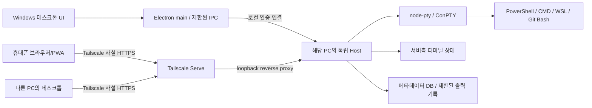

# 몽글터미널 — 시스템 설계와 기술 결정

작성일: 2026-09-29 · 상태: 구현 전 설계안 v0.1

## 1. 권장 구조

**Electron 데스크톱 + 공용 React/TypeScript UI + 별도 Node 호스트 + node-pty/ConPTY + xterm.js + Tailscale 사설 연결**을 우선 검증한다. 이는 라이브러리 조합을 실제 검증 완료했다는 뜻이 아니다. 특히 터미널 상태 복원과 Windows 프로세스 독립성은 P0 통과 후 확정한다.



실행 PC가 데이터와 프로세스의 소유자다. Tailscale은 연결 경로이며 세션을 저장하거나 셸을 대신 실행하지 않는다. 원격 연결 실패를 로컬 실행으로 대체하지 않는다.

## 2. 기술 선택과 대안

| 영역 | 우선안 | 이유와 대가 |
|---|---|---|
| 데스크톱 | Electron | Windows 배포·IME·브라우저 렌더러의 일관성. 설치 크기와 상주 메모리는 부담 |
| 공용 화면 | React + TypeScript, 웹/PWA 빌드 분리 | 데스크톱과 모바일의 레이아웃·터미널 화면을 공유. 모바일 전용 조작은 별도 컴포넌트 |
| PTY | node-pty / Windows ConPTY | PowerShell·CMD를 실제 콘솔 앱으로 실행. native addon 배포 및 ABI 검증 필수 |
| 실행 호스트 | 별도 지원 중 Node LTS runtime | GUI 수명과 분리, node-pty 런타임을 하나로 고정 |
| 터미널 | xterm.js + headless + serialize 계열 | 브라우저·데스크톱 공용. 불완전한 스냅샷/자동 응답 문제를 해결해야 함 |
| 영속 메타데이터 | SQLite, WAL, 단일 writer | 그룹·레이아웃·세션 상태를 트랜잭션으로 갱신. binding은 P0에서 호스트 runtime과 함께 고정 |
| 스트림 | 인증된 WebSocket + 버전 있는 메시지 | 입력·출력·resize·재연결을 같은 프로토콜로 관리 |
| 원격 | 사용자가 설치한 Tailscale + private Serve | 자체 릴레이 운영 없이 PC·모바일 사설 연결 |

Tauri+Rust+portable-pty는 설치 크기와 시스템 통합 면에서 후보지만 Rust 호스트·모바일 WebView/브라우저 차이·추가 bridge 개발을 함께 검증해야 한다. 'Tauri면 자동으로 더 빠르다'고 가정하지 않는다. WezTerm mux는 네이티브 Windows 지원 근거가 있어 배제 사유가 Windows 미지원은 아니다. 다만 브라우저에서 사용하는 별도 프로토콜 어댑터와 제품 UX 구성이 추가된다. 기존 GUI 전체를 포크하면 불필요한 AI·Git·에디터 기능과 업데이트 결합을 함께 떠안으므로 필요한 라이브러리와 검증된 구조를 선택한다.

## 3. 프로세스 및 설치 경계

### 3.1 실행 구조

- `MongleTerminal.exe`: 창·시스템 메뉴·설정·인증 bridge. 셸의 소유자가 아님.
- `mongle-host`: 사용자 계정으로 실행되는 독립 프로세스. PTY, 출력 수집, 터미널 상태, HTTP/WS API, DB를 소유.
- 셸/자식 프로그램: 호스트가 시작하고 관리. GUI와 직접 부모-자식 관계를 갖지 않음.
- Tailscale: 별도 설치 프로그램. 몽글터미널은 설치 유무·접속·Serve 상태를 안내하되 계정 암호나 Tailscale 키를 수집하지 않음.

GUI 최초 실행 시 호스트를 탐색하고, 없으면 실행한다. 준비 응답에서 hostId·hostBootId·protocolVersion을 확인한 뒤 붙는다. 동시 실행은 Windows 사용자별 mutex/검증된 단일 인스턴스 lock으로 조정한다. PID 파일만 보고 살아 있다고 판단하거나 해당 PID를 종료하지 않는다.

로컬 owner 채널은 사용자 SID로 제한한 Windows named pipe를 사용한다. pipe 서버의 SID/프로세스 신원을 검증하고 사용자 ACL로 보호한 secret을 이용한 nonce challenge-response로 상호 인증한다. secret 원문을 탐색된 endpoint에 전송하지 않는다. named pipe DACL·서버 신원 확인을 위한 작은 native binding/launcher는 P0-A의 일부다. owner API는 HTTP/WS gateway에서 받지 않는다. 원격용 cookie 인증과 로컬 owner 인증을 같은 bearer 경로로 합치지 않는다.

Node 문서의 `detached`/`unref` 설정만으로 Windows 모든 런처의 독립성을 보장할 수 있다고 단정하지 않는다. Windows job object 상속, parent kill-on-close, stdio/IPC handle, installer launch 환경을 실제 패키징 상태로 확인한다. 부적합하면 명시적인 사용자 세션 launcher/작업 스케줄러 방식을 검증한다. WMI/작업 스케줄러 등의 우회 시작은 자동 가정하지 않고 선택한 구현과 이유를 ADR에 기록한다.

### 3.2 패키징

지원 중 Node LTS runtime을 앱과 함께 배포하고, node-pty/SQLite native binding은 **호스트 Node ABI**에 맞춰 빌드한다. 개발 PC의 전역 Node나 Electron ABI에 우연히 의존하지 않는다. GUI는 Electron 보안 설정을 유지하고 `ELECTRON_RUN_AS_NODE`가 켜져 있어야만 호스트가 실행되는 구조를 사용하지 않는 것을 기본안으로 한다. GUI 종료와 함께 종료될 수 있는 utility process를 라이브 PTY의 소유자로 두지 않는다.

초기 설치 대상은 Windows 11 x64. 다른 Windows 버전/ARM64, 관리자 권한 셸, 사용자 로그인 전 서비스 실행은 검증 없이 지원으로 표시하지 않는다. 호스트는 기본적으로 일반 사용자 권한이며 UAC 상승을 원격 요청으로 수행하지 않는다.

### 3.3 업데이트

실행 중인 호스트를 업데이트 때문에 강제로 종료하지 않는다. GUI와 호스트의 프로토콜 major가 호환되면 기존 호스트에 연결한다. **major가 다르면 새 설치파일은 준비만 하고 GUI/host 교체를 함께 미룬다.** 기존 GUI·host·웹 자산을 유지해 실행 작업을 계속 확인/조작할 수 있어야 한다. 새 GUI만 먼저 설치된 예외에는 보존한 이전 버전 실행기를 제공한다. 사용 중인 버전 디렉터리는 정리하지 않는다.

사용자가 작업을 종료한 뒤 host writer 종료 → 독점 DB lock 획득 → SQLite backup API에 의한 일관된 백업 → 새 schema migration → 새 host readiness 확인 순서로 전환한다. WAL 파일을 무시한 단순 DB 파일 복사로 백업하지 않는다. migration/readiness 실패 시 새 writer를 종료하고 백업 DB와 구 runtime으로 되돌린다. 이 롤백은 기존 종료된 셸을 부활시키지 않는다. v1은 무중단 PTY 인계나 임의 DB downgrade를 보장하지 않는다.

## 4. 권장 모듈과 저장소 구성

```text
apps/
  desktop/          # Electron main/preload, 설치 및 로컬 연결
  web/              # 모바일/원격 브라우저 entry, PWA
packages/
  host/             # 사용자별 PTY daemon, API, DB, 세션 manager
  ui/               # 그룹·분할·패널·모바일 조작
  terminal/         # xterm renderer와 emulator adapter
  protocol/         # schema, 버전, 이벤트, 권한 검사 계약
  shell-profiles/   # PowerShell/CMD/WSL/Git Bash 탐지와 실행 인수
  storage/          # migration, repository, 제한된 transcript
tests/
  contract/         # 재연결·제어권·입력 중복·schema
  integration/      # 실제 Windows 셸과 packaged lifecycle
  e2e/              # 데스크톱/모바일 흐름
docs/               # 이 설계와 근거, ADR, 검증 기록
```

이는 초기 모듈 분해안이다. 현재 제품 코드는 이 저장소의 apps/packages에 있으며, 구현 과정의 결정과 정확한 버전은 [구현·검증 상태](IMPLEMENTATION-STATUS.md), package-lock.json 및 [제3자 고지](THIRD-PARTY-NOTICES.md)에 기록한다.

## 5. 데이터 모델

| 엔터티 | 핵심 필드/규칙 |
|---|---|
| Host | `hostId`, 표시명, OS, protocolVersion. 설치별 UUID, 주소와 분리 |
| HostBoot | `hostBootId`, 시작 시각. 호스트 재시작마다 바뀜 |
| Group | `groupId`, 이름, 순서, 기본 셸, `defaultCwd`, `revision` |
| Layout | binary split tree: leaf=`terminalId`, branch=`axis/ratio/children`; host/group scope |
| Terminal | `terminalId`, `generation`, profileId, 시작/최근 확인 cwd, cols/rows, lifecycle, exitCode |
| Attachment | clientId, terminalId, 관찰/제어, lastAckSeq, transport state |
| ControllerLease | terminalId, connectionId, leaseEpoch, 만료시각 |
| TrustedDevice | deviceId, 사용자 표시명, credential hash, 생성/최근사용/해제시각 |
| PairingRequest | requestId, requester secret hash, code hash, pending/approved/rejected/claimed/expired, 만료 |
| Snapshot | terminalId+generation+hostBootId, appliedSeq, emulatorVersion, cols/rows, snapshotKind, payload |

터미널 참조는 항상 hostId와 함께 사용한다. 원격 A의 `terminalId`를 로컬 또는 원격 B에 재사용하지 않는다. 레이아웃 변경에는 expectedRevision을 보내고 충돌하면 최신 상태를 다시 받아 변경을 재적용한다. 모든 영속 쓰기는 호스트 단일 writer를 통한다. 클라이언트가 SQLite 파일을 공유하지 않는다.

저장 위치 제안: `%LOCALAPPDATA%\MongleTerminal\`. 설정·DB·기록·인증 자료·로그를 분리한다. 설치 경로, 사용자의 저장소 폴더, OneDrive 동기화 폴더에 실행 DB를 두지 않는다. 비밀은 로그/URL/내보내기에 넣지 않고 Windows 사용자 접근 제어 및 가능한 OS 비밀 저장소를 사용한다.

레이아웃·선택·표시 설정은 변경 후 300ms debounce하여 transaction commit, 명시적 종료 시 flush한다. 비정상 종료 직전 해당 변경은 이 시간 범위에서 손실될 수 있다. **인증 생성·승인·폐기, pairing 코드 소비, terminal generation 변경은 debounce 대상이 아니다.** 성공 응답 전 동기적 영속 transaction을 확정한다. 폐기 중에는 우선 메모리의 접근을 막고 소켓/lease를 해제하며, commit 실패는 실패로 표시하고 연결을 허용하지 않는다. 출력 저장은 별도 checkpoint 정책을 따르며 '모든 출력이 디스크에 영구 저장된다'고 약속하지 않는다. hostBoot마다 만료되는 WS ticket/dedupe/lease는 메모리 전용이며 재시작 후 이전 값을 거부한다.

## 6. 셸 프로필과 작업 폴더

실행 프로필은 executable과 인수 배열로 저장한다. 사용자 경로를 `powershell -Command` 등의 문자열로 이어 붙이지 않는다. 절대 경로·WSL 배포판·Linux 경로를 타입으로 구분한다. `SystemRoot`와 기본 PATH 등 정상 셸 실행에 필요한 환경은 보존하고 호스트의 인증 secret은 자식 환경으로 넘기지 않는다.

WSL 프로필은 `wsl.exe`와 배포판을 명시한다. Windows 경로와 WSL 경로의 변환을 일반 문자열 replace로 처리하지 않는다. 배포판 중지/삭제·프로필 변경·네트워크 경로가 없는 상황을 오류로 표시한다. 사용자 설정 파일을 몰래 수정하지 않는다.

현재 cwd는 최소한 시작 폴더를 보장한다. OSC 7 등 명시적인 보고를 선택적으로 수용할 경우 호스트/경로를 검증하고 메타데이터로만 처리한다. 지원되지 않는 CMD/TUI에서는 cwd를 알 수 없다고 표시한다. v1에서 정확한 현재 폴더가 필요한 셸에만 세션 단위 shell integration을 추가하고 사용자 프로필 파일의 영구 변경 없이 작동하는지 검증한다.

## 7. 터미널 상태와 재접속 — 최우선 기술 위험

**단순 문자열 로그를 다시 출력하는 것만으로는 같은 터미널 상태가 복원되지 않는다.** alternate screen, cursor, 색, 스크롤 영역, bracketed paste, application cursor/keypad, mouse mode, 부분 UTF-8/VT sequence 등이 영향을 준다.

권장 후보는 호스트의 headless emulator가 PTY 출력을 계속 소비하고, UI는 그 상태에 다시 붙는 구조다. 다만 조사한 xterm serializer는 선택된 화면·모드의 재구성이며 모든 parser 내부 상태의 checkpoint가 아니다. 'write callback을 기다렸다'는 사실도 stream의 중간 escape sequence가 끝났다는 뜻은 아니다. 이 간극을 P0에서 먼저 해결한다.

### 7.1 attach 계약

1. 연결을 인증하고 hostId·hostBootId·terminalId·generation과 프로토콜 호환성을 확인한다.
2. 해당 터미널의 순서 있는 실행 큐에 snapshot fence를 넣는다. 출력과 resize도 같은 순서 체계를 따른다.
3. fence K까지 emulator가 실제 처리한 뒤, `appliedSeq=K`와 geometry를 붙인 스냅샷을 생성한다. K 이후 이벤트는 제한된 큐에 보관한다.
4. 클라이언트는 기존 상태를 비우고 스냅샷을 적용한다. 복원 중 PTY로 사용자 입력이나 자동 terminal response를 보내지 않는다.
5. snapshot 적용 완료 ACK 후 K+1 이벤트부터 순서대로 적용한다. gap·세대 불일치·호환 불가 시 새 snapshot을 요청한다.
6. 정상 동기화 뒤 명시적으로 입력 제어권을 획득한다.

짧은 네트워크 단절은 클라이언트가 동일 emulator 상태를 보유하고 ring에 이후 이벤트가 남아 있을 때만 `lastAckSeq` 이후 replay로 복구한다. 새 페이지/앱 재실행은 같은 seq만 보내도 상태가 있다고 판단하지 않고 snapshot부터 시작한다. ACK는 WS 수신 시점이 아니라 `xterm.write` 처리 완료 이후에 보낸다.

### 7.2 불완전 parser와 mode의 처리

P0 결과물로 `TerminalStateAdapter`의 보장 범위를 문서화한다. serializer만으로 통과하지 못하면 다음을 비교하여 하나를 확정한다.

- 버전을 고정한 최소 adapter/상류 수정으로 pending parser continuation과 필요한 modes를 함께 보존한다. 내부 API 사용은 한 모듈에 격리하고 해당 소스·테스트·라이선스를 기록한다.
- 호스트가 완전한 시각 frame과 입력 mode를 보내는 방식을 채택한다. 클라이언트에 불완전 raw PTY stream을 섞지 않으며 변경 범위/지연을 검증한다.
- 동일 요구를 만족하는 기존 mux/emulator를 채택하고 브라우저 프로토콜 adapter 비용을 재평가한다.

미완료 escape sequence를 삭제하거나, Ctrl+L/명령 재실행으로 화면을 맞추거나, 제한 없는 전체 로그 replay로 문제를 숨기지 않는다. P0 실패 시 '세션 재연결 완료' 상태를 제품에 제공하지 않고 이 결정을 다시 연다.

### 7.3 terminal response 소유권

DSR/DA 등 프로그램의 질의에 답하는 주체는 **호스트 한 곳**이다. 호스트와 각 xterm renderer가 동시에 응답하면 응답이 중복되어 명령 프롬프트/TUI에 섞일 수 있다. xterm의 공개 `onData`는 사용자 입력과 일부 자동 응답을 같은 문자열 이벤트로 전달하므로 단순히 모두 PTY로 넘기지 않는다. `disableStdin` 하나로 제어 중 사용자의 키와 자동 응답을 구분할 수도 없다.

P0에서 입력 provenance를 구분하는 version-pinned adapter 또는 검증된 다른 입력 경로를 확정한다. 관찰자·snapshot 복원·숨겨진 UI의 자동 응답은 절대 PTY 입력이 되지 않도록 한다. headless가 처리하지 않는 색/창 크기 질의는 host의 명시된 terminal capability로 답한다. TERM·Unicode 폭 규칙·폰트·renderer/headless 버전은 계약에 포함한다.

지원 목표는 일반 VT/ANSI, true color, 기본 mouse reporting, bracketed paste, alternate screen, 한글/emoji/wide glyph이다. Sixel/Kitty 그래픽, 특수 이미지 프로토콜, 모든 터미널 확장을 v1 호환으로 주장하지 않는다.

## 8. 출력 흐름 제어와 자원 한도

- PTY 출력 수집은 모든 화면이 닫혀도 계속한다. 느린 관찰자 때문에 전체 호스트의 출력을 멈추지 않는다.
- 빠른 출력은 batch로 처리하고 headless의 write 완료를 기준으로 생산자 backpressure를 적용한다. host emulator 자체가 감당하지 못할 때만 `node-pty.pause/resume` 등의 검증된 경로로 조절한다.
- 클라이언트별 송신 큐가 한도를 넘으면 오래된 incremental queue를 버리고 해당 클라이언트만 resync 상태로 보낸다. 필요한 연속성이 없어졌다는 표시 없이 중간 출력을 생략하지 않는다.
- 가려진 UI는 렌더러를 해제해도 서버 session은 유지한다. 복귀 시 snapshot을 받는다.

초기 튜닝값(성능 보장 아님): 클라이언트 송신 high-water 2MiB, 세션 replay ring 4MiB, 입력 frame 최대 64KiB, heartbeat 5초/lease 15초, 화면 resize 100ms debounce. 기록은 터미널당 최근 5,000줄·저장 파일 16MiB, 전체 저장 512MiB를 상한으로 제안한다. 저장 상한이 host emulator 메모리까지 자동 제한한다고 가정하지 말고 각 메모리 큐에도 독립 한도를 둔다.

오래된 transcript를 정리해도 현재 화면과 최근 유효 snapshot은 보존한다. 한도를 초과하는 단일 snapshot은 잘라서 '정상'으로 제공하지 않고 기록 저장 제한을 표시한다. 데이터 정리는 session lifecycle과 transaction으로 조정한다. 디스크 장애는 세션 실행과 기록 실패를 분리해 표시한다.

## 9. 제어권과 입력의 정확성

제어권은 터미널별 `connectionId + leaseEpoch`다. 입력·resize 모두 현재 epoch와 인증 권한을 검사한다. 명시적 '여기서 제어' 요청에는 원하는 cols/rows도 포함한다. 서버의 순서 있는 큐에서 **이전 lease 해제 → epoch 증가 → resize 및 geometry fence 생성 → 새 제어자의 화면 적용 ACK → 입력 활성화**를 수행한다. 그 사이 새 제어자는 `control-syncing` 상태이고 키/마우스 입력을 보내지 않는다. 이전 기기는 관찰 상태로 전환한다. 관찰자 resize는 무시한다. 전환 중 회전/IME 상태 변화는 최신 geometry로 다시 동기화하고 미제출 조합 문자를 자동 전송하지 않는다.

입력은 `inputId`와 단조 증가 `clientInputSeq`를 포함한다. 동일 hostBootId/session generation 내의 제한된 dedupe cache로 재전송을 거부한다. ACK는 '호스트가 입력을 수락했음'을 의미하며 셸 명령 성공을 뜻하지 않는다. 소켓 단절로 결과를 모르면 자동 재전송하지 않는다. 호스트 크래시를 넘는 정확히 한 번 실행 보장은 제공하지 않는다.

```text
Session: created → starting → running → stopping → exited
                              └ host loss → interrupted
Attachment: connecting → authenticating → syncing → observing/controlling
                                                     └ disconnect → reconnecting
Persisted previous session: interrupted/exited → [사용자 새 셸 열기] → 새 generation
```

연결 상태와 프로세스 상태는 다른 필드다. WebSocket이 끊겼다고 세션을 exited로 바꾸지 않고, 호스트가 재부팅되었다면 이전 PID를 새 프로세스에 연결하지 않는다.

## 10. API 초안

| 경로/메시지 | 역할/제약 |
|---|---|
| `GET /health` | 최소 상태·프로토콜만, 세션/사용자 경로/출력 미노출 |
| `owner.pairing.create` | 인증된 local named pipe에서만 코드 생성. HTTP endpoint 아님 |
| `POST /v1/pairings/request` | 코드 검증 후 pending 요청과 requester secret 발급. 아직 device session 없음 |
| `owner.pairing.approve/reject` | PC에서 요청 확인 후 상태 확정. 원격에서 호출 불가 |
| `POST /v1/pairings/claim` | 원래 requester secret과 approved 상태를 확인해 한 번만 session cookie 발급 |
| `POST /v1/pairings/status` | requester secret으로 해당 요청 상태만 조회; 세션/출력 노출 안 함 |
| `GET /v1/state` | 인증된 host/group/layout/session 목록 |
| `POST/PATCH/DELETE /v1/groups/...` | 인증·CSRF·revision 검증 |
| `POST /v1/terminals` | 검증된 host-local profile/cwd로 생성 |
| `POST /v1/terminals/:id/terminate` | 명시적 종료, 다른 ID/host로 확장 금지 |
| `POST /v1/ws-ticket` | 인증·CSRF, 메모리용 단기 WS ticket 발급 |
| `/v1/socket` | cookie+Origin 검증 후 첫 frame ticket, 미인증 timeout |
| `attach/snapshot/output/resize/ack` | host/session generation, seq 및 geometry 포함 |
| `control.acquire/release/revoked` | lease epoch와 기기 표시명 |
| `terminal.input/input.ack/error` | 입력 식별자·lease 검사, 실패 사유 코드 |

버전 없는 임의 JSON을 수용하지 않는다. schema 검증, 메시지 크기 한도, rate limit, host-scoped ID 검증을 공유 패키지에 둔다. 로그에 실제 입력 문자열·출력 payload·cookie·code·token을 남기지 않는다.

## 11. 근거와 결정 상태

- [Microsoft ConPTY 세션 수명·resize·종료](https://learn.microsoft.com/en-us/windows/console/creating-a-pseudoconsole-session)
- [Node detached child process](https://nodejs.org/api/child_process.html#optionsdetached)
- [node-pty 공식 저장소](https://github.com/microsoft/node-pty)
- [xterm 흐름 제어](https://xtermjs.org/docs/guides/flowcontrol/)
- [xterm 보안](https://xtermjs.org/docs/guides/security/)
- [Electron sandbox](https://www.electronjs.org/docs/latest/tutorial/sandbox), [fuses](https://www.electronjs.org/docs/latest/tutorial/fuses)

위 자료는 각각의 기본 기능 근거다. 몽글터미널의 조합 전체가 검증되었다는 근거는 아니다. 실제 source commit 및 제한 사항은 [오픈소스 비교](05-open-source-comparison.md)와 하위 연구 메모에 정리한다.
